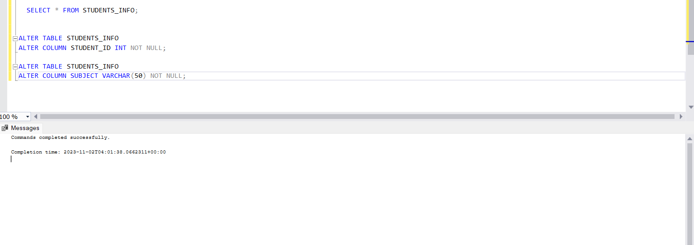
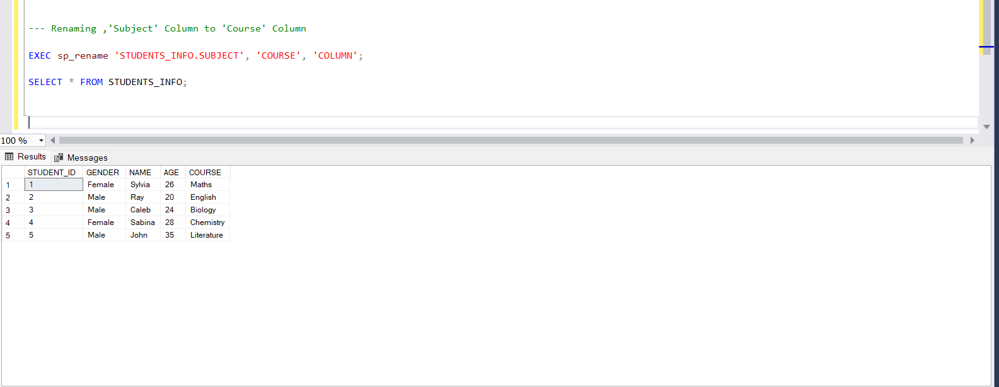

# SQL-PROJECT-CREATING-AND-MANAGING-A-RELATIONAL-DATABASE

## INTRODUCTION
This repository documents the creation and management of "Students_Record" database; a relational database using SQL (Structured Query Language). The project involves creating three tables, adding constraints, altering table structure, and inserting sample data. The tables include "students_info," "health_records," and "performance."

*Disclaimer: This Database is comprised of a dummy dataset and does not represent any individual or organisation.*

## SQL SKILLS EXPLORED

-	Database Creation
-	Table Creation
-	Data Types
-	Primary Key
-	Foreign key
-	Normalisation
-	Constraint
-	Column Alteration
-	Join

## NOTABLE SQL FUNCTIONS AND COMMANDS USED IN THIS PROJECT

-	CREATE TABLE: I used the ‘CREATE TABLE’ syntax to create the ‘students_info,’ ‘health,’ and ‘performance’ tables.

-	ALTER TABLE: I used the ‘ALTER TABLE’ statement to modify the structure of tables, such as adding constraints, renaming columns, and dropping columns.

-	INSERT INTO: I used the ‘INSERT INTO’ syntax to insert sample data into my tables.
  
-	EXEC.sp_rename: I used this to rename my column.

## DATABASE SCHEMA

### Table: Students_Info

#### Columns:
-	Student_id (Primary key)
-	Gender
-	Name
-	Course
	
#### Constraints:
-	‘Student_id’ is a Primary Key
-	‘Subject’ and ‘Student_id’ cannot be NULL

### Table: Health_records
#### Columns:
-	Health_id (Primary Key)
-	Blood group
-	Height
-	Weight

#### Constraints:
-	‘Health_id’ is a Primary Key

### Table: Performance
#### Columns:
-	Performance_id (Primary Key)
-	student_id (Foreign Key)
-	health_id (Foreign Key)
-	score
-	gender

  
### Table Alterations
•	Renamed the "subject" column in the "students_info" table to "course."
•	Dropped the "age" column from the "students_info" table.

## SQL COMMANDS AND RESULTS

### 1.	Creating the ‘Students_Record’ Database
I created the Database and named it as ‘Students_Record’

### 2.	Creating the Tables
I created the tables and columns, populating them with values and ensuring that ID were unique. Primary keys were used for Dimension Tables while Foreign keys were used for Facts Tables.

- Students_Info Table

-	Health_Records Table
  

### 3.  Creating a Performance Table and then forming a Relationship among the 3 tables

In this database, Students_Info Table and Health_Records Table are both Dimensions tables as they contain categorical information while Performance Table is the facts table in the Student_Records database as it contains numerical values.

A relationship was created among all 3 tables to link them together in the database using the keys.
Student_ID in the performance table was used to link Student_ID in the students_info table.
Health_ID in the performance table was used to link Health_ID in Health_records Table.

### 4.	Adding Constraints: This was achieved using NOT NULL. This will stop columns where I have added this constraint from taking null values. As you can see, from the syntax and results, the not null was added to student_id column and subject column.

### 5.	Renaming the Column: I renamed column name ‘Subject’ to ‘Course’ using Exec.sp_rename old column name with new column name.

### 6.	Dropping A Column: Best practices for a data engineer is to make a copy of a table before dropping a column in SQL. This is because a column which has been dropped cannot be restored and all values will be lost. After making a copy of the table, I dropped the ‘Age’ Column.
	

## CONCLUSION 
I have successfully designed and managed a 'Students Records' database using SQL. I created tables, enforced data integrity through constraints, and adapted the structure to evolving needs. This project has equipped me with valuable skills in SQL, data organization, and has prepared me for future data analysis and custom query development. It highlights my dedication to effective data management, a critical asset for informed decision-making.

#CHEERS! 😄

   

